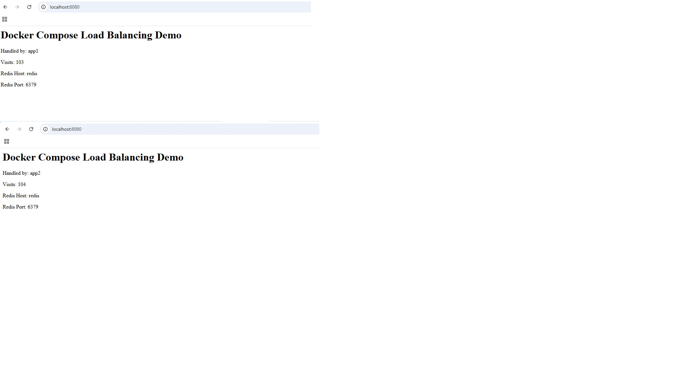

# Docker Compose NGINX + Node.js + Redis Lab

## 🚀 Demo Overview

This project demonstrates a simple load balancing setup using NGINX in front of two Node.js application instances, with Redis as a shared state backend.

It is a hands-on Docker lab focused on building and running a multi-container application using Docker Compose, NGINX, Node.js, and Redis.

## Project Goal

The goal of this lab is to practice core Docker and containerization concepts in a realistic but simple setup:

- Build a custom Node.js application image
- Run multiple services with Docker Compose
- Use Redis as a shared state backend
- Use NGINX as a reverse proxy
- Demonstrate basic load balancing across two app instances
- Persist data with Docker volumes
- Use environment variables for runtime configuration
- Apply retry logic for service dependency resilience

## Architecture

Client requests flow through NGINX and are forwarded to one of two Node.js application containers.  
Both application containers use Redis as a shared backend to store the visit counter.

```text
Client -> NGINX -> app1 / app2 -> Redis
``` 
Example of load balancing between two app instances:



Services
app1 / app2

Two identical Node.js application containers.
They read and update a shared visit counter from Redis.

redis

Used as the shared persistent data store for the visit counter.

nginx

Acts as a reverse proxy and distributes requests between app1 and app2.

How to Run

docker compose up --build

Open:

http://localhost:8080

Key Learnings

Difference between container startup and service readiness

Importance of retry logic in distributed systems

Stateless vs stateful service design

Reverse proxy and request routing with NGINX

Basic load balancing strategies

Shared state using Redis

Notes

This is a local lab project intended for learning containerization and basic DevOps patterns.
